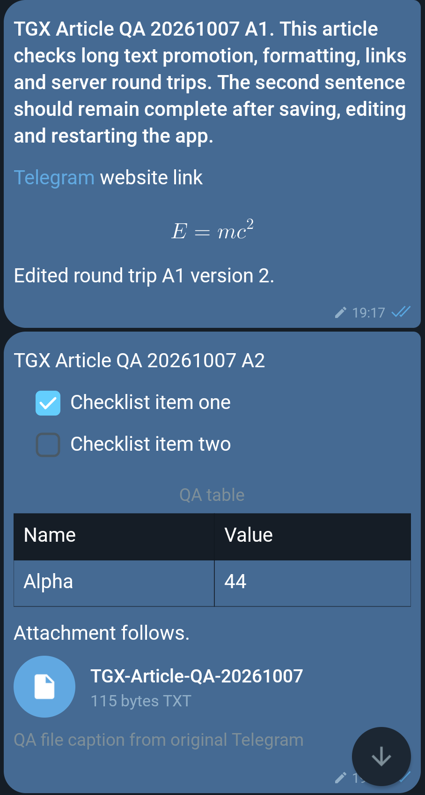
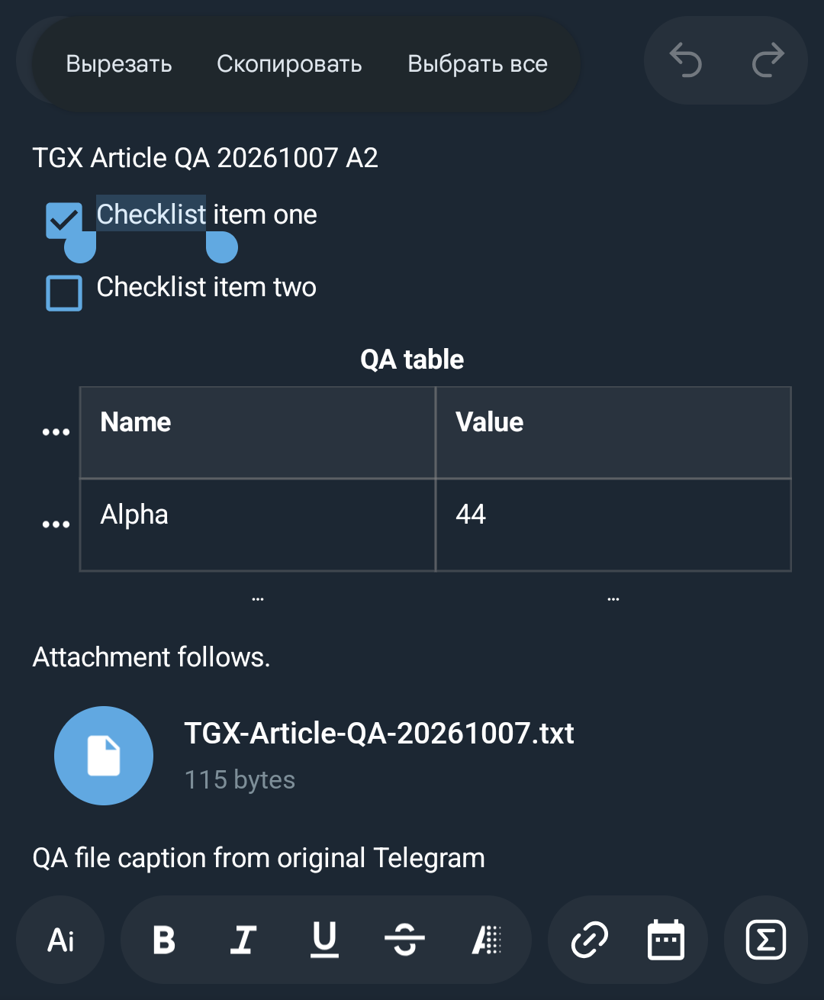
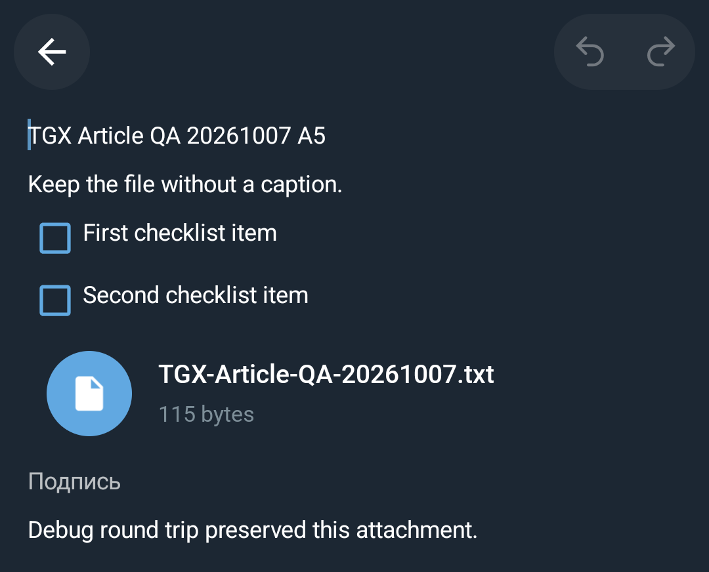
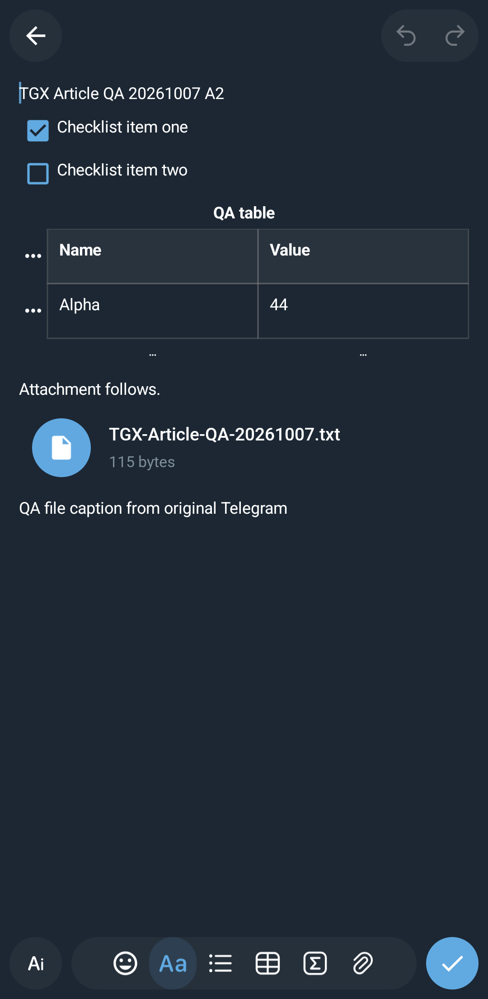

# Native article messages

This feature adds TDLib rich messages to Telegram X's existing message, composer,
draft and media flows. It is independent of the forum-topic contribution: no
forum controllers, product branding, private configuration or native changes are
added by the feature diff.

## User-facing behavior

- Articles render in message history using native page blocks, with text styles,
  links, headings, lists, quotes, tables, formulas, buttons and media. Incomplete
  rich messages can load their full content; a failed load can be retried.
- The ordinary composer offers expansion after more than two nonempty visual
  lines. Posting respects chat permissions and TDLib's `rich_message_posting`
  option, including the premium-only mode. Secret chats are excluded.
- One inline editor supports creating articles, restoring rich drafts and
  editing eligible existing messages. Its contextual tools act on the selected
  text or block, including nested lists and cross-block selection.
- The editor supports block reordering, split/join operations, undo/redo,
  preview, attachment pickers and a table/formula editor. Imported local files
  are copied into private storage instead of depending on a temporary picker
  permission.
- AI composition/correction uses TDLib requests initiated by the user. There is
  no third-party AI endpoint or separate provider key. Server availability and
  permissions remain authoritative; AI results are previewed before applying.

## Implementation map

| Area | Main entry points |
|---|---|
| Message display and full-content loading | `TGMessageArticle`, `ArticleBodyView`, `PageBlock*` |
| Composer, edit, send and draft integration | `MessagesController`, `ArticleComposer`, `ArticleSendTracker` |
| Editor, preview and contextual controls | `ArticleEditorController`, `ArticlePreviewController`, `ArticleDocumentView`, `ArticleTextInput` |
| Document transformations and history | `ArticleEditorTree`, `ArticleRichText`, `ArticleTableGrid`, `ArticleHistory` |
| Durable drafts and typed conversion | `ArticleDraftStore`, `ArticleCodec`, `ArticleMapper`, `ArticleValidator` |
| Media and AI result handling | `ArticleMediaFiles`, `ArticleEditorMedia`, `ArticleAiResult`, `ArticleAiEditor` |

`scripts/generate-article-codec.py` generates the bounded typed codec from the
pinned TDLib schema. Runtime persistence does not use reflection or Java object
serialization. Tests cover round trips, invalid input, transformations, draft
comparison, composer promotion, AI diff normalization and send-state handling.

Formula rendering uses the Gradle dependency `ru.noties:jlatexmath-android`.
Its reflective parser needs the explicit R8 rules included in this change.
Malformed formulas have a text fallback; rendering size/cache bounds are kept.

## Resources and design

The feature uses Telegram X controllers, theme helpers, media components and
translation keys. English strings are in `values/strings.xml`; new translations
need the normal translation-platform import rather than locale-specific source
files. Editor icons have 24x24 viewports and `_24` size suffixes.

The original Telegram editor informed the interaction design. Asset and adapted
layout attribution, including the bundled font license, is recorded in
[ARTICLE_EDITOR_ASSETS.md](../app/ARTICLE_EDITOR_ASSETS.md).

## Review and validation boundaries

This is a new design submitted for discussion. Device checks cover the named
scenarios below; they do not establish every role, device or server outcome.
Maintainer CI, accessibility, concurrent draft recovery, premium transitions,
permission/rejection cases, very large/partial articles and broader device/ABI
coverage remain to be completed before merge readiness.

The contribution contains only cropped captures of deliberately created test
articles. Private chat content, account identifiers, credentials, local build
harnesses and APKs are not included.

Review should focus on native message/layout integration, editor UX and
accessibility, draft recovery/lifecycle behavior, server rejection handling,
and unchanged ordinary chat/Instant View behavior.

## Validation snapshot — 2026-10-07

Tested feature source: `36c32c7f1c71568f65b981e6dde17c4074902131`, including
upstream `92f13cbe5eeac21ae06cecb58d92d2c0a676cc53`. Device APK source:
product integration `9ca7f45b7b0f43bf5c0c8c408f8703a463a27282`.

- **56/56 article JVM tests passed** in seven suites. New regressions cover
  received media without a caption, lazy caption/credit editing and preservation
  of received/generated file names without rewriting file references.
- **588/588 product JVM tests passed**. ARM64 Debug and R8 Release builds passed,
  including native configuration/build with the current upstream pins.
- Production-source Debug and Release lint reported no new issues; 17 existing
  warnings were filtered by the unchanged baseline. Test-source UAST is excluded
  by the local Windows harness because of an analysis stall; executable JVM
  tests are included. The harness is not part of this contribution.
- Both APKs were updated in place on a **Pixel 6, Android 17 (API 37)**. Existing
  app identities/data were preserved and installed APK hashes were verified.
- Server-backed Saved Messages retests passed in both builds: a file without a
  caption remains visible when reopening Edit, its full name is present, and
  native checklist markers toggle without shifting the text. Pixel comparison
  confirmed identical text regions across both checkbox states.
- Editing a neighboring paragraph preserved the uncaptioned attachment;
  adding a caption to the received file survived saving and app restart.
  Official Telegram 12.10.6 received the same file, caption and checklist state.
- Existing formula/link/table examples and public-channel article text/media
  rendered in Release; the seven-photo album opened and advanced. Debug also
  reopened the channel article. No new crashes were recorded during the retest.

Earlier device scenarios covered create/edit/send, AI correction preview/apply,
draft continuation and offline send/retry. They exposed the three defects fixed
above. Earlier isolated widget checks at `cf7ce04f` passed 23/23 cases; those
component results are historical, not a fresh run on this revision.

### Device examples

These are pixel-preserving crops of actual ADB screenshots from the Release
build above, captured on 2026-10-07. Only purpose-made test articles are shown.
Surrounding chats, pinned messages and system bars were cropped out; no UI was
redrawn or composited. The installed application's Russian UI is shown as tested;
upstream translation resources still follow the normal translation process.

Published articles with formatted text, a link, formula, checklist, table and file:

Selected text changes the editor's contextual formatting tools:

Reopening a server-received attachment with no caption:

Editor with its ordinary block toolbar:

