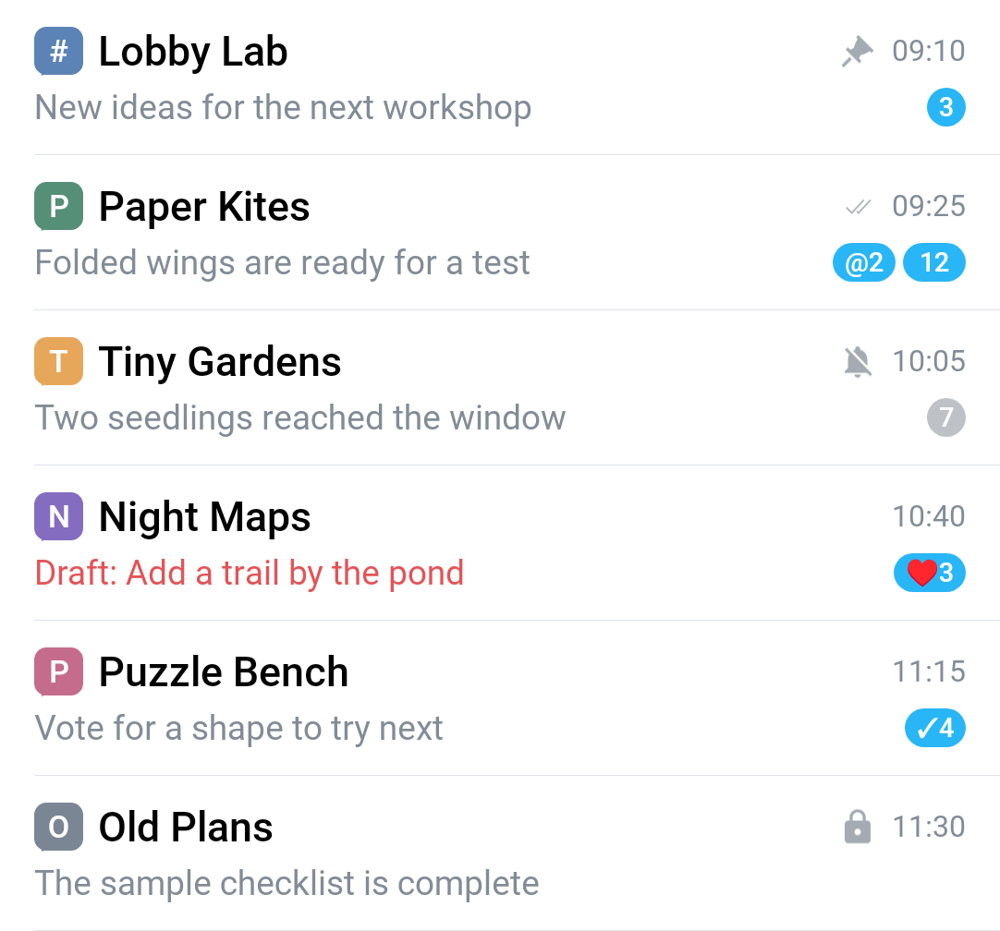
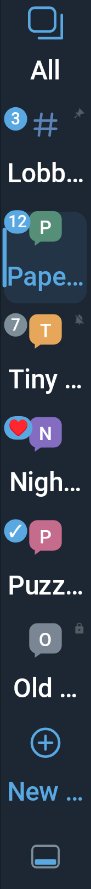

# Forum UI component examples

These PNGs were rendered on Android by `ForumUpstreamDemo` using the production `ForumTopicView` and `ForumTopicsTabsView`. All names, messages, times and counters are invented in-memory fixtures. The test target has no account, application components or network permission.

These are **component crops**, not full-screen application screenshots, before/after comparisons, server tests or frame-time measurements. Topic rows use the isolated presentation-field fixture rather than account-dependent binding. Topic selectors use the real `setTopics` and RecyclerView layout paths. Default topic icons are shown; custom emoji are not downloaded.

## Topic rows (light theme)

Two-line rows reserve the right-hand area for time, pin/mute/closed/delivery indicators and counters. Drafts replace the message preview. The title line includes the topic icon.

## Horizontal selector (dark theme)

The compact selector includes All, ordered topic tabs, unread indicators, selection and a fixed placement control. The crop uses a wide viewport to show several tabs at once; narrower viewports scroll.

## Side selector (dark theme, RTL, 180% font scale)

This deliberately narrow, tall crop shows every synthetic item. Labels ellipsize at the larger font scale; the complete localized text remains in the accessibility description. The viewport normally scrolls independently of the fixed placement control.

See `FORUM_ACCEPTANCE.md` for the broader, separately recorded device/server acceptance matrix and the account-isolated test target.
