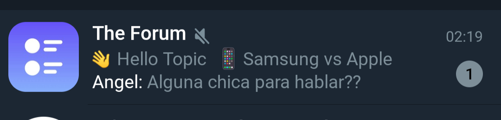
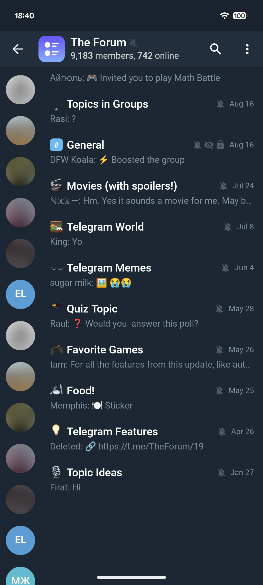
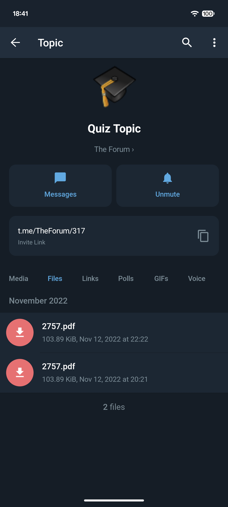
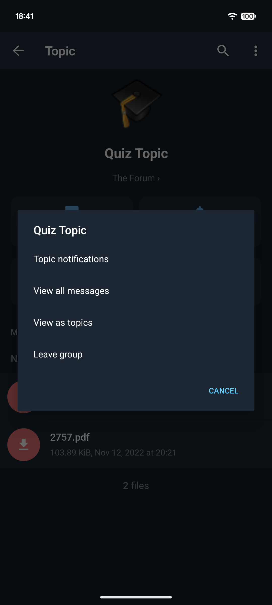
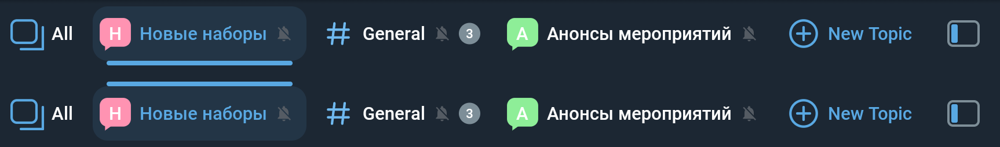
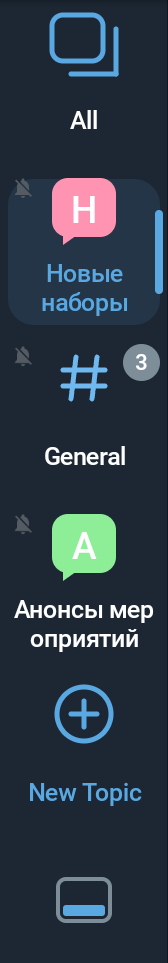

# Forum UI examples

## Application screenshots

These four screenshots were supplied by the maintainer on October 10, 2026,
from the development fork. They show the public **The Forum** group, not the
private test forum. The images are preserved as supplied, including the
existing chat-rail avatar redactions. They are UI illustrations, not new
runtime verification of the feature-only PR APK or before/after comparisons.

### Forum preview in the chat list

The group name, recent topic icons/names, latest sender/message preview and
unread count appear in one chat row.

### Topic list and chat navigation rail

The full-width group header sits above the topic list and the narrow chat rail.
Topic icons and right-aligned status indicators stay inside their rows.

### Topic profile and shared files

The profile exposes Messages and Unmute, a visible topic link with a copy
action, and topic-scoped shared-media filters with the Files tab selected.
Available actions depend on the user's permissions and topic state.

### Topic profile actions

The overflow menu offers notification settings, all-message/topic-list views
and leaving the group for the captured permissions and state.

## Horizontal selector

The compact horizontal panel includes All, topic icons and names, unread
counters, mute indicators, the active topic, New Topic and the placement
control. The upper example shows the panel above message history; the lower
example shows it below history. The topic list scrolls horizontally when it
does not fit the available width.

## Side selector

The narrow vertical panel places each topic icon above its name and preserves
unread, mute and selection indicators. All and New Topic remain available;
the placement control sits at the bottom.

See `FORUM_ACCEPTANCE.md` for the broader, separately recorded device/server acceptance matrix and the account-isolated test target.

## Legacy Android behavior

On API 16–17, forum navigation uses the same-progress fade instead of avatar morphing because view clip bounds require API 18. API 18+ keeps the morph transition. Relative layout and live-region APIs are guarded; API 16 uses the platform's left-to-right layout with physical padding/margins. Labeled accessibility actions are registered on API 21+, while older versions retain node descriptions and standard click behavior.

These compatibility paths need separate old-device verification; the images above were not captured on legacy Android.
